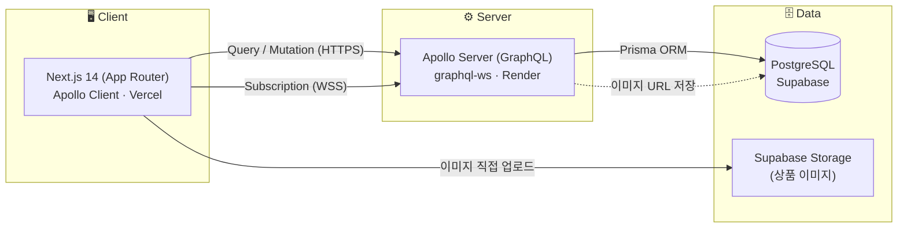

# 🥕 동네장터 (Dongne Jangteo)

> **"우리 동네 중고거래 — GraphQL의 강점을 눈으로 확인하는 당근마켓 오마주 웹 서비스"**

<br>

## 👋 프로젝트 소개
**동네장터**는 동네를 기준으로 중고 물품을 사고파는 커뮤니티형 마켓 서비스입니다.
단순한 CRUD를 넘어 **GraphQL의 핵심 강점**(오버/언더페칭 해결, 실시간 Subscription, 타입 안전성)을
실제 기능으로 체감할 수 있도록 설계했습니다.

상품을 **카드형 피드**로 둘러보고, 상세 화면에서 **한 번의 요청**으로 연관 정보를 모두 받아오며,
구매자·판매자가 **새로고침 없이 실시간으로 대화**하는 경험을 제공합니다.

<br>

* **🔗 서비스:** [carrot-web-rose.vercel.app](https://carrot-web-rose.vercel.app)
* **GraphQL API:** [dongne-jangteo-server.onrender.com/graphql](https://dongne-jangteo-server.onrender.com/graphql)

> ⏳ 백엔드가 Render 무료 티어라, 첫 접속 시 서버가 깨어나는 데 **30~60초** 걸릴 수 있어요. (이후엔 즉시 응답)

<br>

## 🚀 주요 기능
* **동네 기반 홈 피드:** 내 동네 상품을 카드 그리드로 조회 — 카테고리 필터, 상품명 검색, 커서 기반 무한 스크롤, 찜 수 표시.
* **상품 상세 (언더페칭 제로):** 이미지·판매자·판매자의 다른 상품·문의 댓글을 **GraphQL 한 번의 쿼리**로 조회. 찜하기, 문의 댓글, 판매/거래완료 상태 변경.
* **실시간 채팅 (Subscription):** 상품 기준 1:1 채팅. **GraphQL Subscription(WebSocket)** 으로 상대 메시지가 새로고침 없이 실시간 도착. 이전 메시지 페이지네이션, 안 읽음 표시.
* **상품 등록 + 이미지 업로드:** 사진을 **Supabase Storage에 직접 업로드**하고 URL만 저장하는 방식으로 서버 부하 최소화.
* **인증 & 게스트 열람:** JWT 이메일 로그인/회원가입. 피드·상세는 **비로그인 공개**, 찜·댓글·채팅 등 액션만 로그인 요구.

<br>

## 🛠️ 시스템 아키텍처



- **조회/등록**은 HTTP(Query/Mutation), **실시간 채팅**은 WebSocket(Subscription)으로 분리
- 이미지: 클라이언트 → Storage 직접 업로드 → **URL만 GraphQL로 저장**

<br>

## ⚙️ 기술 스택

### **Frontend**
| 구분 | 기술 (Technology) | 설명 |
| :--- | :--- | :--- |
| **Framework** |  | App Router 기반 웹 (SSR/CSR) |
| **Language** |  | 프론트·백엔드 타입 공유 |
| **GraphQL Client** |  | 캐싱, 페이지네이션, Subscription |
| **Styling** |  | 카드 UI 스타일링 |
| **Hosting** |  | 웹 호스팅 및 배포 |

### **Backend**
| 구분 | 기술 (Technology) | 설명 |
| :--- | :--- | :--- |
| **Runtime** |  | 서버 런타임 |
| **API** |   | 단일 엔드포인트 GraphQL API |
| **Realtime** |  | Subscription(실시간 채팅) 전송 |
| **ORM** |  | 스키마 기반 타입 자동생성 |
| **Auth** |  | 토큰 기반 인증 (리졸버 컨텍스트 검증) |
| **Hosting** |  | 상시 구동(WS 유지) 백엔드 배포 |

### **Database & Storage**
| 구분 | 기술 (Technology) | 설명 |
| :--- | :--- | :--- |
| **Database** |  | 사용자·상품·채팅 데이터 저장 |
| **BaaS** |  | Postgres 호스팅 + 이미지 Storage |

<br>

## 📂 레포지토리 구조

**npm workspaces 기반 모노레포** — 프론트·백엔드가 GraphQL 타입을 공유합니다.

```
dongne-jangteo/
├── apps/
│   ├── web/          # Next.js 14 + Apollo Client + Tailwind   → Vercel
│   └── server/       # Apollo Server + Prisma + graphql-ws     → Render
├── docs/
│   ├── 기획서.md      # 서비스 기획
│   └── 개발계획.md    # 단계별 개발 로드맵
├── CLAUDE.md         # Claude Code 프로젝트 컨텍스트
└── README.md
```

| 워크스페이스 | 설명 | 주요 스택 |
| :--- | :--- | :--- |
| **`apps/web`** | 웹 클라이언트, 피드/상세/채팅 UI | Next.js, Apollo Client, Tailwind |
| **`apps/server`** | GraphQL API, 인증/인가, 실시간 구독 | Apollo Server, Prisma, PostgreSQL |

<br>

## 🧩 왜 GraphQL인가

GraphQL이 REST 보다 **빛을 발하는 지점**은
-> **"여러 종류의 연관 데이터를, 한 화면에서, 클라이언트가 원하는 모양 그대로"** 가져와야 할 때입니다.

이 프로젝트의 **상품 상세 화면**이 정확히 그 사례입니다. 하나의 화면이 서로 다른 6종류의 데이터를 동시에 요구합니다 —
`상품 정보` · `이미지 여러 장` · `판매자` · `판매자의 다른 상품` · `문의 댓글` · `각 댓글 작성자`.

**REST라면** 여러 엔드포인트를 순차 호출(워터폴)하거나, 안 쓰는 필드까지 뭉친 거대한 응답을 받아야 합니다:

```http
GET /products/:id
GET /products/:id/images
GET /users/:sellerId
GET /users/:sellerId/products
GET /products/:id/comments   →  댓글마다 다시 GET /users/:authorId ...
```

**GraphQL은** 화면이 필요로 하는 모양 그대로, **단 한 번의 요청**으로 끝날 수 있게됩니다:

```graphql
query ProductDetail($id: ID!) {
  product(id: $id) {
    title price status
    images { url }                              # 여러 장
    seller {                                    # 판매자
      nickname
      otherProducts(first: 4) { id title thumbnailUrl }   # 판매자의 다른 상품
    }
    comments { content author { nickname } createdAt }     # 댓글 + 작성자
  }
}
```

> 클라이언트가 **응답의 모양을 직접 결정**하므로, 화면이 바뀌어도 서버 엔드포인트를 새로 만들 필요가 없습니다.

### 프로젝트에 녹인 GraphQL의 강점
| 강점 | 이 프로젝트에서 |
| :--- | :--- |
| **연관 데이터 한 번에 (언더페칭 해결)** | 상세 화면의 이미지·판매자·다른 상품·댓글을 **1회 요청**으로 |
| **원하는 필드만 (오버페칭 해결)** | 피드 카드는 필요한 필드(제목·가격·썸네일·찜수)만 골라 조회 |
| **실시간성 (Subscription)** | `messageAdded` 구독으로 채팅 메시지를 새로고침 없이 수신 |
| **타입 안전성** | Prisma 스키마 → GraphQL 스키마 → TS 타입까지 일관되게 연결 |

<br>

## 🧪 시연 계정

| 이메일 | 비밀번호 | 역할 |
| :--- | :--- | :--- |
| `june@demo.com` | `password123` | 판매자 |
| `minji@demo.com` | `password123` | 구매자 |

> 두 계정으로 각각 로그인해 같은 채팅방을 열면, 실시간 메시지 전송을 확인할 수 있습니다.

<br>

## 🤖 Claude Code로 개발한 방식

혼자 진행한 1인 프로젝트로, **Claude Code**를 페어 프로그래머로 활용해 기획부터 구현·검증·문서화까지 진행했습니다.
단순히 코드를 받아쓰는 대신, **문서로 맥락을 관리하고 권한을 통제하는** 워크플로우를 직접 설계한 점이 핵심입니다.

* **📄 문서(.md) 기반 지시 — "단일 진실 공급원(SSOT)"**
  구두 지시 대신 `docs/기획서.md` · `docs/개발계획.md` 등을 만들어
  요구사항·결정사항·셋업 절차를 문서로 고정하고, 이 문서를 근거로 작업을 지시했습니다.
  맥락이 흐트러지지 않고, 다음 단계로 넘어갈 때 판단 기준이 명확해집니다.

* **🗺️ Plan 모드 · Auto 모드 구분 사용**
  스키마 설계, 단계 전환, 방식 결정처럼 **방향이 중요한 작업은 Plan 모드**로 계획을 먼저 검토·승인했고,
  반복적이고 명확한 구현은 **Auto 모드**로 빠르게 진행해 속도와 안정성을 함께 챙겼습니다.

* **🔒 민감 파일 읽기 차단 규칙 (권한 통제)**
  `.claude/settings.json` 의 `permissions.deny` 에 `Read(**/.env)` 등을 등록해,
  **DB 비밀번호·API 키가 담긴 `.env` 를 Claude가 아예 읽지 못하도록** 원천 차단했습니다.
  비밀값은 런타임만 사용하고 **AI의 컨텍스트에는 절대 들어가지 않도록** 통제했습니다.
  (특수문자 비밀번호는 코드에서 URL 인코딩해 주입 — 값 자체를 노출하지 않고 처리)

* **✅ 실제 동작 기반 검증**
  타입체크·빌드에 그치지 않고, **헤드리스 브라우저로 로그인·피드·상세·실시간 채팅·이미지 업로드를
  실제 구동해 확인**하며 각 단계를 마무리했습니다.

<br>

## 👥 팀원 소개

| 이름 | 역할 (Role) | 담당 파트 | GitHub |
| :---: | :--- | :--- | :---: |
| **송채희** | **Full-Stack (1인 개발)** | 기획 · 프론트엔드 · GraphQL 백엔드 · 인프라/배포 | [@chaeheesong](https://github.com/chaeheesong) |

<br>
